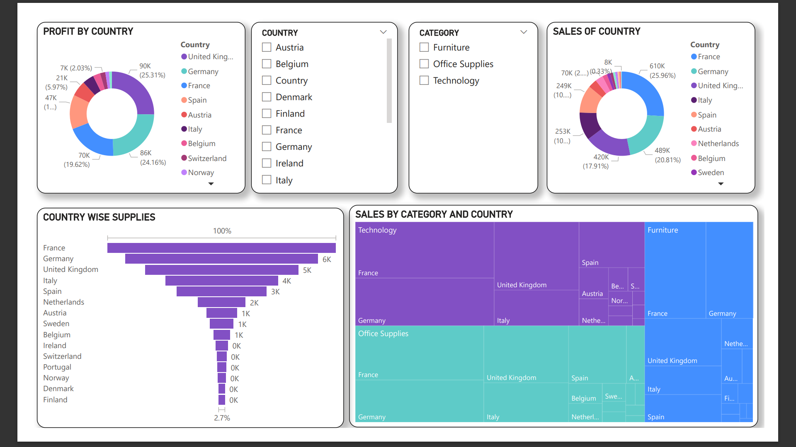
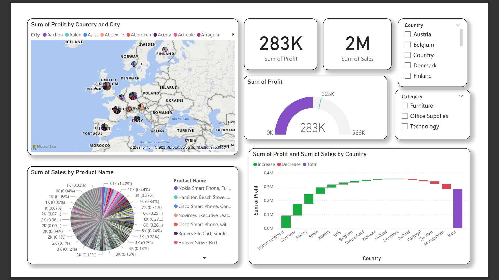

# Power BI Profit Analysis Report

## Description

This repository contains a Power BI report that provides a comprehensive analysis of profit data by category and country. The report allows users to gain insights into the performance of different product categories across various countries and make informed decisions based on profit trends.

## Features

- Visualizations: Interactive charts and graphs to visualize profit data.
- Data Exploration: Drill-down capabilities to explore profit trends at different levels of granularity.
- Filter Options: Filters for category selection and country-wise analysis.
- Export Functionality: Allows users to export visualizations for further analysis.

## Screenshots

## How to Use

1. **Download Power BI Desktop:** If you don't have it already, download and install [Power BI Desktop](https://powerbi.microsoft.com/en-us/desktop/).

2. **Clone or Download Repository:** Clone this repository to your local machine or download it as a ZIP file.

3. **Open the Power BI Report:**
   - Locate the Power BI file in the repository (e.g., `profit_analysis_report.pbix`).
   - Double-click the file to open it in Power BI Desktop.

4. **Interact with the Report:**
   - Explore the report by selecting different categories and countries.
   - Utilize the various filters and drill-down options to analyze profit data.

5. **Export Data:**
   - If needed, you can export visualizations or data for external use.
